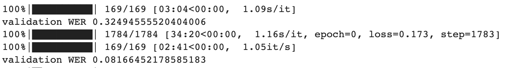

# HomeWork 3 - Making sense of speech

### 1. Implementation of functions to calculate the Levenshtein distance, the Character Error Rate (CER) and the Word Error Rate (WER).
All implementation is in metrics.py file. Complexity of such implementation is O(m * n), where m and n is length of input sequences (words)

### 2 Whisper Fine tuning
Whisper fine-tunning done in file __main__.py, while MyDataset and Trainer class in training_utils.py.
I trained model for 1 epoch, during that WER on validation dataset improved from 0.32 to 0.08

As a results fine-tunned whisper on file /tests/jfk.flac return followed transcription

[00:00.000 --> 00:10.500]  And so my fellow Americans ask not what your country can do for you, ask what you can do for your country.
